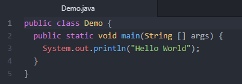

## Java
In order to be able to compile and run Java code in your computer, you must install the Java JDK 
JDK stands for "<b>Java Development Kit</b>" 
 
Once you have JDK installed on your computer you can navigate to the folder 
where all the executable files are located 
 
<b>Java's Bin folder location</b>
 
 
The first thing you'll have to do is to add the Java's bin folder path inside the system's PATH 
 
PATH is an "<b>environment variable</b>" that tells the OS where to find executable files 
 
You must use the "<b>set path</b>" CLI command as shown below: 
 
 
## Java Hello World!
As you can see, even the simple and classic "<b>Hello World</b>" code is a little bit 
complicated in Java 
 

## Compile then run
We are going to use 2(two) executable files, <b>"javac.exe"</b> when compiling and <b>"java.exe"</b> when running 
<b>java.exe</b> will invoke the java Virtual Machine in the background, totally transparent for us 
 
<b>Before Compilation</b> 
 
## Compiling with javac 
 
 
<b>After Compilation</b> 
Immediately after the compilation is done, you'll see that another file was created 
that file with extension <b>".class"</b> is what in Java is known as <b>"bytecode"</b> 
 
## Running java code 
 

